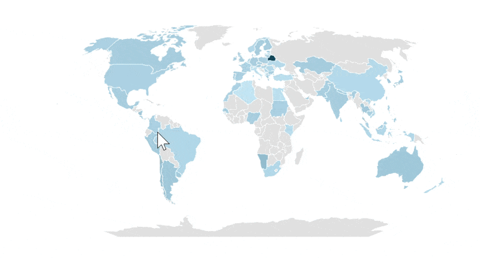
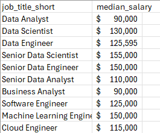

# Projet Dashbord Excel
# Analyse Offres Emploi Data dans le Monde


## Introduction

> Ce projet consiste en la création d'un dashbord interactif sous Microsoft Excel permettant d'analyser les offres d'emploi dans le domaine de la data dans le monde.
> Ce projet peut aider à avoir un apperçu des salaires des metiers de la data à travers le monde. Le tableau de bord fournit les informations sur les salaires médians selon les métiers, les types de contrats les plus proposés, les pays offrant le plus d'opportunités, les plateformes de recrutement les plus utilisé, le nombre total d'offres d'emploi.
> L'Objectif principal de ce projet est de transformer des données brutes en informations visuelles facilles à comprendre afin d'aider à la prise de décision et à l'analyse du marché de l'emploi data dans le monde.

### Objectifs du Projet
Pratiquer l'analyse de données avec Excel, Concevoir un dashbord interactif et lisible, explorer le marché des métiers de la data dans le monde, presenter des indicateurs clés (KPI), developper des compétences en visualisation de données.

### Outils Utilisé
Microsoft Excel (Power Query, Tableaux croisés dynamiques, Graphiques dynamiques, Segments/Slicers, validation des données, fonctions et formules), Github pour le partage du projet.

### Dashboard File
My final dashboard is in [Salary_Dashboard.xlsx](Data_Science_Salary_Dashbord.xlsx).

### Ensemble de Données

Les données utilisé pour ce projet proviennent des informations du monde reel des metiers de la science de données.
 Les données qui ont servi à l'elaboration de ce projet provienne du tutoriel de Luke Barousse. Ils contiennent des information detaillés sur les different job, a savoir, le nom, le salaires, la localité, etc...

## Structure du Dashbord

### 📉 Charts

#### 📊 Data Science Job Salaries - Bar Chart


- 🛠️ **Excel Features:** Utilized bar chart feature (with formatted salary values) and optimized layout for clarity.
- 🎨 **Design Choice:** Horizontal bar chart for visual comparison of median salaries.
- 📉 **Data Organization:** Sorted job titles by descending salary for improved readability.
- 💡 **Insights Gained:** This enables quick identification of salary trends, noting that Senior roles and Engineers are higher-paying than Analyst roles.

#### 🗺️ Country Median Salaries - Map Chart



- 🛠️ **Excel Features:** Utilized Excel's map chart feature to plot median salaries globally.
- 🎨 **Design Choice:** Color-coded map to visually differentiate salary levels across regions.
- 📊 **Data Representation:** Plotted median salary for each country with available data.
- 👁️ **Visual Enhancement:** Improved readability and immediate understanding of geographic salary trends.
- 💡 **Insights Gained:** Enables quick grasp of global salary disparities and highlights high/low salary regions.

### 🧮 Formulas and Functions

#### 💰 Median Salary by Job Titles

```
=MEDIAN(
IF(
    (jobs[job_title_short]=A2)*
    (jobs[job_country]=country)*
    (ISNUMBER(SEARCH(type,jobs[job_schedule_type])))*
    (jobs[salary_year_avg]<>0),
    jobs[salary_year_avg]
)
)
```

- 🔍 **Multi-Criteria Filtering:** Checks job title, country, schedule type, and excludes blank salaries.
- 📊 **Array Formula:** Utilizes `MEDIAN()` function with nested `IF()` statement to analyze an array.
- 🎯 **Tailored Insights:** Provides specific salary information for job titles, regions, and schedule types.
- **🔢 Formula Purpose:** This formula populates the table below, returning the median salary based on job title, country, and type specified.

🍽️ Background Table



📉 Dashboard Implementation


#### ⏰ Count of Job Schedule Type

```
=FILTER(J2#,(NOT(ISNUMBER(SEARCH("and",J2#))+ISNUMBER(SEARCH(",",J2#))))*(J2#<>0))
```

- 🔍 **Unique List Generation:** This Excel formula below employs the `FILTER()` function to exclude entries containing "and" or commas, and omit zero values.
- **🔢 Formula Purpose:** This formula populates the table below, which gives us a list of unique job schedule types.

🍽️ Background Table


📉 Dashboard Implementation:


### ❎ Data Validation

#### 🔍 Filtered List

- 🔒 **Enhanced Data Validation:** Implementing the filtered list as a data validation rule under the `Job Title`, `Country`, and `Type` option in the Data tab ensures:
    - 🎯 User input is restricted to predefined, validated schedule types
    - 🚫 Incorrect or inconsistent entries are prevented
    - 👥 Overall usability of the dashboard is enhanced


## Conclusion

I created this dashboard to showcase insights into salary trends across various data-related job titles. Utilizing data from Luke Barousse's Excel course, this dashboard allows users to make informed decisions about their career paths. Exploring the functionalities to understand how location and job type influence salaries. 
