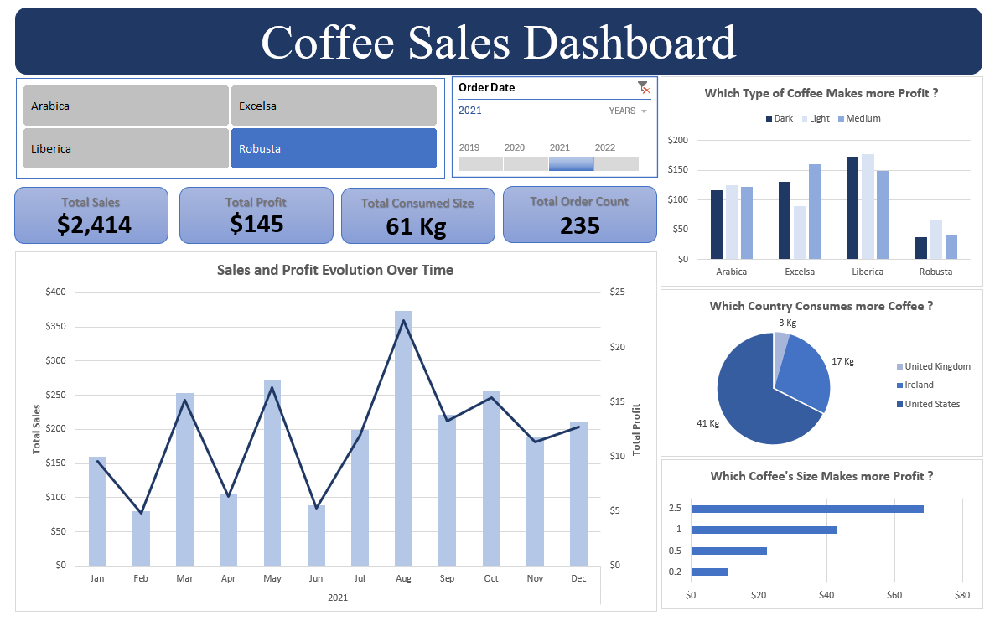

# ☕ Coffee Sales Dashboard

### 📌 Project Overview

The Coffee Sales Dashboard is an interactive Excel dashboard designed to analyze coffee sales performance and provide business insights. It allows users to monitor key performance indicators (KPIs), explore sales trends, and compare the profitability of different coffee types, sizes, and customer locations.

The dashboard was built using Microsoft Excel features such as Pivot Tables, Pivot Charts, Slicers, and dashboard formatting to create an easy-to-use reporting interface.

**Project Structure**
- [Excel Coffee Sales Dashboard File (.xlxx)](coffee_sales_dashboard.xlsx)
- [Project Description (README File)](README.md)
- [Project Data Directory /](data/)
- [Project Images Directory /](images/)

### 🎯 Objectives

- Monitor overall sales performance.
- Analyze monthly sales and profit trends.
- Compare profitability across coffee varieties.
- Identify the countries with the highest coffee consumption.
- Determine which coffee size generates the most profit.
- Provide interactive filtering for better business analysis.

### 🛠 Tools & Skills Used
- Microsoft Excel
- Pivot Tables
- Pivot Charts
- Slicers
- Dashboard Design
- Data Cleaning
- Data Analysis
- KPI Reporting
- Data Visualization

## 📊 Dashboard Features
### Key Performance Indicators (KPIs)

The dashboard displays four main business metrics:

- Total Sales
- Total Profit
- Total Coffee Consumed
- Total Orders

Interactive Filters, Users can filter the dashboard by:

- Coffee Type
- Order Year

These slicers automatically update all charts and KPIs.

### Visualizations

📈 **Sales and Profit Over Time**

A combination column and line chart shows: Monthly sales revenue, Monthly profit and Seasonal performance trends

☕ **Profit by Coffee Type**

A clustered column chart compares the profitability of: Arabica, Excelsa, Liberica, and Robusta across different roast levels (Dark, Light, and Medium).

🌍 **Coffee Consumption by Country**

A pie chart illustrates coffee consumption by country, making it easy to identify the largest customer markets.

📦 **Profit by Package Size**

A horizontal bar chart compares profit generated by different coffee package sizes to determine which size performs best.

## 💡 Business Insights

This dashboard helps answer important business questions such as:

- Which coffee type generates the highest profit?
- How do sales and profits change throughout the year?
- Which countries consume the most coffee?
-Which package size is the most profitable?
- How do different roast levels affect profitability?

### Conclusion

This project demonstrates practical Excel skills for business intelligence, sales reporting, and interactive dashboard development, making it a valuable portfolio project for aspiring Data Analysts and Business Intelligence Analysts.