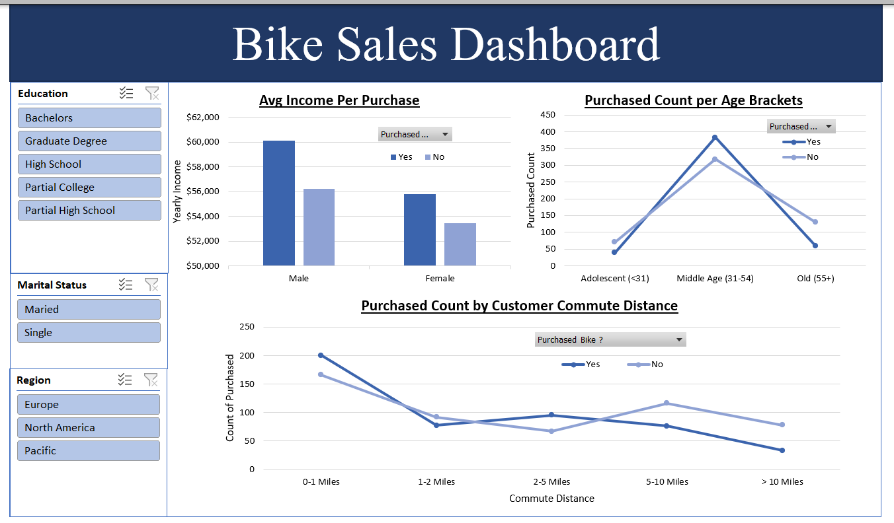

# 🚴 Bike Sales Dashboard

## 📌 Project Overview

The Bike Sales Dashboard is an interactive Excel dashboard that analyzes customer purchasing behavior to uncover the factors influencing bike sales. It provides insights into customer demographics, income levels, age groups, and commute distances, helping businesses better understand their target market and purchasing patterns.

The dashboard was built using Microsoft Excel with Pivot Tables, Pivot Charts, Slicers, and interactive visualizations to create an intuitive business intelligence report.

### 🎯 Project Objectives
Analyze customer purchasing behavior.
Compare average income between customers who purchased bikes and those who did not.
Identify which age groups are most likely to purchase bikes.
Explore the relationship between commute distance and bike purchases.
Enable dynamic filtering by customer demographics. 

### 🛠 Tools & Skills Used
- Microsoft Excel
- Pivot Tables
- Pivot Charts
- Slicers
- Dashboard Design
- Data Cleaning
- Data Analysis
- KPI Reporting
- Data Visualization
- Interactive Reporting

### **Project Structure**
- [Excel Bike Sales Dashboard File (.xlxx)](Bike_Sales_Dashboard.xlsx)
- [Project Description (README File)](README.md)
- [Project Data Directory /](data/)
- [Project Images Directory /](images/)

## 📊 Dashboard Features

**Interactive Filters**

The dashboard allows users to filter the analysis by: Education(Bachelors,Graduate Degree, High School and etc..), Marital Status and Region.
All charts update automatically based on the selected filters.

📈 **Average Income per Purchase**

A clustered column chart compares the average yearly income of customers who purchased a bike versus those who did not, separated by gender.

Key insights include:

- Income differences between male and female customers.
- Relationship between income level and purchasing behavior.

👥 **Purchased Count by Age Brackets**

A line chart displays the number of customers who purchased and did not purchase bikes across three age groups:
Adolescent (<31), 
Middle Age (31–54), and 
Old (55+)

This visualization helps identify the age segment with the highest purchase rate.

🚲 **Purchased Count by Customer Commute Distance**

A line chart analyzes bike purchases based on customers' daily commute distances: 0–1 Miles, 
1–2 Miles, 
2–5 Miles, 
5–10 Miles, and
More than 10 Miles

This chart helps determine how commuting distance influences purchasing decisions.

## 💡 Business Insights

This dashboard helps answer important business questions such as:

- Which customer groups are more likely to purchase bikes?
- Does income influence purchasing behavior?
- Which age bracket has the highest number of bike buyers?
- How does commute distance impact purchasing decisions?
- How do education, marital status, and region affect bike sales?

### 🚀 Key Learning Outcomes

This project demonstrates the ability to:

- Build interactive Excel dashboards using Pivot Tables and Pivot Charts.
- Design dynamic reports with Slicers for data exploration.
- Analyze customer demographics and purchasing behavior.
- Transform raw sales data into actionable business insights.
- Present data effectively through clear and interactive visualizations.

### 📌 Conclusion

The Bike Sales Dashboard showcases how Excel can be used as a powerful business intelligence tool to analyze customer data and support data-driven decision-making. It highlights practical skills in data analysis, dashboard design, and interactive reporting, making it a strong portfolio project for aspiring Data Analysts, Business Analysts, and Business Intelligence Analysts.