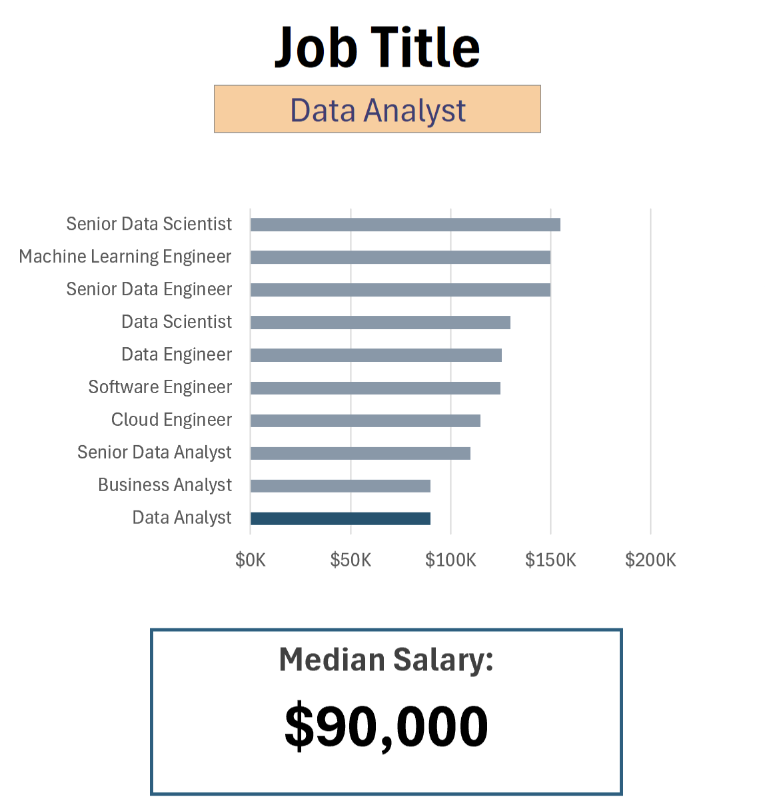
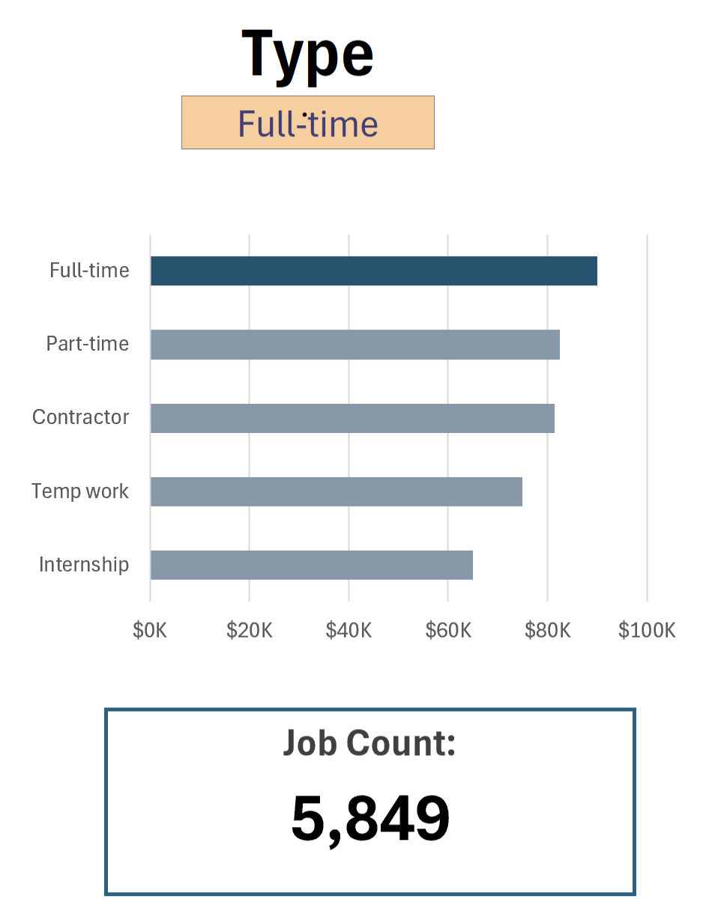

# Data Jobs Dashboard


**Project Structure**
- [Excel Data Jobs Dashboard File (.xlxx)](Data_Jobs_Dashboard.xlsx)
- [Project Description (README File)](README.md)
- [Project Data Directory /](data/)
- [Project Images Directory /](images/)


 ---


## Introduction

### Project Overview

This project focuses on building an interactive dashboard in Microsoft Excel to analyze jobs salaries in the data industry across the world.

The dashboard provides insights into:

- Median salaries across data-related roles
- Job distribution by employment type
- Countries with the highest number of opportunities
- Most popular job platforms
- Total number of job listings

The main goal of this project is to transform raw job market data into meaningful and interactive visual insights that support data-driven decision-making

### Project Objectives

- Pratice data analysis using Excel
- Design an interactive and user-friendly dashboard
- Explore trends in the data job market
- Present key performance indicators (KPIs)
- Improve data visulalization skills

### Tools & Technologies

- Microsoft Excel
    - **📉 Charts**
    - **🧮 Formulas and Functions**
    - **❎ Data Validation** 
- Github for project sharing and documentation


### Data Jobs Dataset

The dataset used for this project contains real-world data science job information from 2023. It includes detailed information on:

- **👨‍💼 Job titles**
- **💰 Salaries**
- **📍 Locations**
- **🛠️ Skills**


## Dashboard Features

### 📉 Charts

#### 📊 Data Science Job Salaries - Bar Chart


- 🛠️ **Excel Features:** Utilized bar chart feature (with formatted salary values) and optimized layout for clarity.
- 🎨 **Design Choice:** Horizontal bar chart for visual comparison of median salaries.
- 📉 **Data Organization:** Sorted job titles by descending salary for improved readability.
- 💡 **Insights Gained:** This enables quick identification of salary trends, noting that Senior roles and Engineers are higher-paying than Analyst roles.

#### 🗺️ Country Median Salaries - Map Chart


- 🛠️ **Excel Features:** Utilized Excel's map chart feature to plot median salaries globally.
- 🎨 **Design Choice:** Color-coded map to visually differentiate salary levels across regions.
- 📊 **Data Representation:** Plotted median salary for each country with available data.
- 👁️ **Visual Enhancement:** Improved readability and immediate understanding of geographic salary trends.
- 💡 **Insights Gained:** Enables quick grasp of global salary disparities and highlights high/low salary regions.

### 🧮 Formulas and Functions

#### 💰 Median Salary by Job Titles

```
=MEDIAN(
IF(
    (jobs[job_title_short]=A2)*
    (jobs[job_country]=country)*
    (ISNUMBER(SEARCH(type,jobs[job_schedule_type])))*
    (jobs[salary_year_avg]<>0),
    jobs[salary_year_avg]
)
)
```

- 🔍 **Multi-Criteria Filtering:** Checks job title, country, schedule type, and excludes blank salaries.
- 📊 **Array Formula:** Utilizes `MEDIAN()` function with nested `IF()` statement to analyze an array.
- 🎯 **Tailored Insights:** Provides specific salary information for job titles, regions, and schedule types.
- **🔢 Formula Purpose:** This formula populates the table below, returning the median salary based on job title, country, and type specified.

🍽️ Background Table


📉 Dashboard Implementation



#### ⏰ Count of Job Schedule Type

```
=FILTER(J2#,(NOT(ISNUMBER(SEARCH("and",J2#))+ISNUMBER(SEARCH(",",J2#))))*(J2#<>0))
```

- 🔍 **Unique List Generation:** This Excel formula below employs the `FILTER()` function to exclude entries containing "and" or commas, and omit zero values.
- **🔢 Formula Purpose:** This formula populates the table below, which gives us a list of unique job schedule types.

🍽️ Background Table


📉 Dashboard Implementation:



### ❎ Data Validation

#### 🔍 Filtered List

- 🔒 **Enhanced Data Validation:** Implementing the filtered list as a data validation rule under the `Job Title`, `Country`, and `Type` option in the Data tab ensures:
    - 🎯 User input is restricted to predefined, validated schedule types
    - 🚫 Incorrect or inconsistent entries are prevented
    - 👥 Overall usability of the dashboard is enhanced


### key Insights

Some insights identified from the dashboard include:
- Senior Data Scientist and Machine Learning Engineer roles tend to offer the highest salaries
- Full-time positions represents the majority of job postings
- Indeed appears to be the leading recruitment platform in the data
- The United States has one of the most highest concentration of job opportunities

### Skills Demonstrated

This project helped strengthen my skills in:

- Data Cleaning
- Data Analysis
- Data Visualization
- Dashboard Design
- Advanced Excel Techniques
- Business Insight Communication

## Conclusion

I created this dashboard to showcase insights into salary trends across various data-related job titles. Utilizing data from Luke Barousse Excel course, this dashboard allows users to make informed decisions about their career paths. Exploring the functionalities to understand how location and job type influence salaries. 
